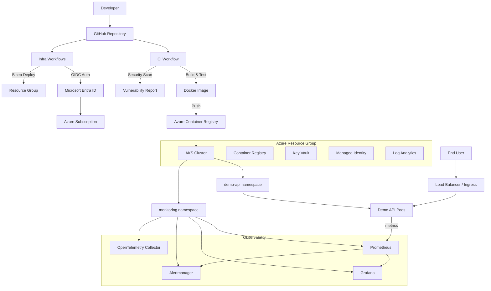

# AKS SRE Platform Lab


A production-style AKS platform demonstrating Infrastructure as Code, secure CI/CD, Kubernetes deployments, observability, SLO-based alerting, and incident response automation.

---

## Table of Contents

- [Architecture](#architecture)
- [Repository Structure](#repository-structure)
- [Features](#features)
- [SRE Practices Demonstrated](#sre-practices-demonstrated)
- [Tech Stack](#tech-stack)
- [Prerequisites](#prerequisites)
- [Getting Started](#getting-started)
- [Deployment](#deployment)
- [Observability](#observability)
- [Cost Control](#cost-control)
- [Documentation](#documentation)
- [Contributing](#contributing)
- [License](#license)

---

## Architecture



See [docs/architecture.md](docs/architecture.md) for detailed architecture documentation.

---

## Repository Structure

```text
aks-sre-platform-lab/
├── app/
│   ├── main.py                        # FastAPI application
│   ├── requirements.txt               # Python dependencies
│   ├── Dockerfile                     # Container image definition
│   └── tests/
│       └── test_main.py               # Unit tests
├── infra/
│   ├── main.bicep                     # Orchestrator module
│   ├── aks.bicep                      # AKS cluster module
│   ├── acr.bicep                      # Container Registry module
│   ├── keyvault.bicep                 # Key Vault module
│   ├── managed-identity.bicep         # Managed Identity module
│   └── parameters/
│       ├── dev.bicepparam             # Dev environment parameters
│       └── prod.bicepparam            # Prod environment parameters
├── helm/
│   └── demo-api/
│       ├── Chart.yaml                 # Helm chart metadata
│       ├── values.yaml                # Default values
│       ├── values-dev.yaml            # Dev overrides
│       └── templates/
│           ├── deployment.yaml        # Kubernetes Deployment
│           ├── service.yaml           # Kubernetes Service
│           ├── ingress.yaml           # Ingress resource
│           ├── hpa.yaml               # Horizontal Pod Autoscaler
│           ├── serviceaccount.yaml    # ServiceAccount
│           ├── configmap.yaml         # ConfigMap
│           └── networkpolicy.yaml     # NetworkPolicy
├── monitoring/
│   ├── prometheus-rules/
│   │   ├── slo-alerts.yaml            # SLO-based alert rules
│   │   └── app-alerts.yaml            # Application alert rules
│   ├── grafana-dashboards/
│   │   ├── app-dashboard.json         # Application metrics dashboard
│   │   └── cluster-dashboard.json     # Cluster health dashboard
│   └── opentelemetry/
│       └── collector-config.yaml      # OTel Collector configuration
├── sre/
│   ├── slos.md                        # Service Level Objectives
│   ├── error-budget-policy.md         # Error budget policy
│   ├── incident-runbook.md            # Incident response runbook
│   ├── postmortem-template.md         # Postmortem template
│   ├── oncall-checklist.md            # On-call checklist
│   └── capacity-planning.md           # Capacity planning guide
├── .github/
│   └── workflows/
│       ├── ci.yml                     # PR validation (test, lint, build)
│       ├── infra-validate.yml         # Bicep validation workflow
│       ├── infra-deploy.yml           # Infrastructure deployment
│       ├── image-build.yml            # Container image build and push
│       ├── deploy-dev.yml             # Helm deploy to AKS
│       └── security-scan.yml          # Security scanning workflow
├── docs/
│   ├── architecture.md                # Architecture documentation
│   ├── setup-guide.md                 # Setup instructions
│   ├── cost-control.md                # Cost management guide
│   └── screenshots.md                 # Screenshots and evidence
├── .gitignore
├── bicepconfig.json
├── LICENSE
└── README.md
```

---

## Features

- **Infrastructure as Code** — Azure Bicep modules for AKS, ACR, Key Vault, Managed Identity
- **Secretless CI/CD** — GitHub Actions with OIDC authentication to Azure (no stored secrets)
- **Container Workflow** — Docker build, security scan, push to ACR
- **Helm Deployments** — Templated Kubernetes deployments with environment-specific values
- **Kubernetes Best Practices** — Health probes, resource limits, HPA, NetworkPolicy, ServiceAccount
- **Full Observability** — Prometheus metrics, Grafana dashboards, Alertmanager, OpenTelemetry
- **SLO-Based Alerting** — Availability, latency, and error rate SLOs with error budget tracking
- **SRE Documentation** — Runbooks, postmortem templates, on-call checklists, capacity planning
- **Security Scanning** — Dependency, container image, and IaC vulnerability scanning
- **Cost Control** — Local development mode (kind/minikube) and Azure teardown automation

---

## SRE Practices Demonstrated

- SLIs and SLOs
- Error budgets and budget policies
- Alert tuning and noise reduction
- Runbook-driven incident response
- Postmortem process
- Capacity planning
- Change management
- Observability (metrics, dashboards, distributed tracing)

---

## Tech Stack

| Component | Technology |
|---|---|
| Cloud Platform | Microsoft Azure |
| Infrastructure as Code | Azure Bicep |
| CI/CD | GitHub Actions |
| Authentication | OIDC / Microsoft Entra Workload Identity |
| Container Runtime | Docker |
| Container Registry | Azure Container Registry |
| Container Orchestration | Azure Kubernetes Service (AKS) |
| Package Manager | Helm |
| Secrets Management | Azure Key Vault |
| Metrics | Prometheus |
| Dashboards | Grafana |
| Alerting | Alertmanager |
| Tracing | OpenTelemetry |
| Monitoring | Azure Log Analytics |
| Application | Python FastAPI |

---

## Prerequisites

- Azure subscription with Contributor access
- Azure CLI (`az`) installed
- Docker installed
- Helm 3 installed
- kubectl installed
- GitHub account with repository admin access
- Microsoft Entra App Registration with OIDC federated credentials
- Python 3.11+ (for local development)

---

## Getting Started

### 1. Clone the repository

```bash
git clone https://github.com/<your-username>/aks-sre-platform-lab.git
cd aks-sre-platform-lab
```

### 2. Run the application locally

```bash
cd app
pip install -r requirements.txt
uvicorn main:app --reload --port 8000
```

Test the endpoints:

```bash
curl http://localhost:8000/health
curl http://localhost:8000/ready
curl http://localhost:8000/metrics
curl http://localhost:8000/simulate-latency?seconds=1
curl http://localhost:8000/simulate-error
```

### 3. Run tests

```bash
cd app
pip install pytest httpx
pytest tests/ -v
```

### 4. Build the Docker image

```bash
docker build -t demo-api:local app/
docker run -p 8000:8000 demo-api:local
```

---

## Deployment

See [docs/setup-guide.md](docs/setup-guide.md) for the full deployment guide covering:

1. Azure infrastructure provisioning via Bicep
2. GitHub OIDC configuration
3. Container image build and push to ACR
4. Helm deployment to AKS
5. Monitoring stack installation
6. Post-deployment verification

---

## Observability

| Tool | Purpose |
|---|---|
| Prometheus | Metrics collection and SLO-based alerting |
| Grafana | Dashboards for application and cluster metrics |
| Alertmanager | Alert routing and notification |
| OpenTelemetry | Distributed tracing and metric export |
| Log Analytics | Azure-native container logging |

Key metrics tracked:

- Request count and rate
- Error rate (HTTP 5xx)
- Request latency (p50, p95, p99)
- Pod CPU and memory usage
- Pod restart count
- Deployment health and availability

---

## Cost Control

This project supports two modes:

- **Local Mode** — Use kind or minikube with local Prometheus/Grafana (no Azure cost)
- **Azure Mode** — Deploy to AKS with full cloud infrastructure

Cleanup command:

```bash
az group delete --name rg-aks-sre-platform-dev --yes --no-wait
```

See [docs/cost-control.md](docs/cost-control.md) for detailed cost management strategies.

---

## Documentation

- [Architecture](docs/architecture.md) — architecture diagrams and design decisions
- [Setup Guide](docs/setup-guide.md) — step-by-step deployment instructions
- [Cost Control](docs/cost-control.md) — cost management strategies
- [SLOs](sre/slos.md) — service level objectives
- [Error Budget Policy](sre/error-budget-policy.md) — error budget rules
- [Incident Runbook](sre/incident-runbook.md) — incident response procedures
- [Postmortem Template](sre/postmortem-template.md) — blameless postmortem format
- [On-Call Checklist](sre/oncall-checklist.md) — on-call engineer checklist
- [Capacity Planning](sre/capacity-planning.md) — capacity planning guide

---

## Contributing

Contributions are welcome! Please open an issue or submit a pull request.

---

## License

This project is licensed under the MIT License. See [LICENSE](LICENSE) for details.
