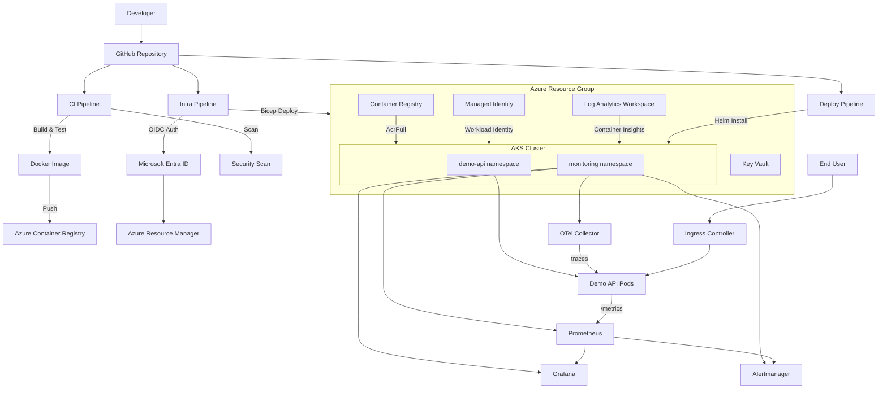
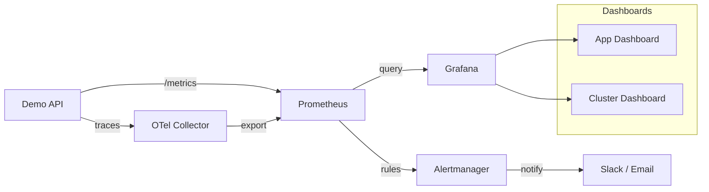

# Architecture

## Overview

This platform deploys a containerized FastAPI application to Azure Kubernetes Service using a fully automated CI/CD pipeline. Infrastructure is provisioned with Azure Bicep, deployments are managed with Helm, and observability is provided by Prometheus, Grafana, Alertmanager, and OpenTelemetry.

## Architecture Diagram



## Components

### Demo API Application

A Python FastAPI service with built-in observability endpoints.

| Endpoint | Purpose |
|---|---|
| `GET /health` | Liveness probe — always returns healthy |
| `GET /ready` | Readiness probe — checks dependencies |
| `GET /metrics` | Prometheus-compatible metrics |
| `GET /simulate-latency` | Injects configurable delay for testing |
| `GET /simulate-error` | Returns 500 for alerting validation |

### Azure Infrastructure

| Resource | Bicep Module | Purpose |
|---|---|---|
| AKS Cluster | `aks.bicep` | Managed Kubernetes with autoscaler, AZs, auto-upgrade |
| Container Registry | `acr.bicep` | Private Docker registry (admin disabled) |
| Key Vault | `keyvault.bicep` | Secret storage with RBAC authorization |
| Managed Identity | `managed-identity.bicep` | Workload identity for AKS pods |
| Log Analytics | `main.bicep` | Container Insights and log aggregation |

### CI/CD Pipelines

| Workflow | Trigger | Purpose |
|---|---|---|
| `ci.yml` | Pull requests | Lint, test, build Docker image, security scan |
| `infra-validate.yml` | PR (infra changes) | Bicep lint and validate |
| `infra-deploy.yml` | Manual dispatch | Deploy Azure infrastructure |
| `image-build.yml` | Manual / push to main | Build and push container image to ACR |
| `deploy-dev.yml` | Manual dispatch | Helm deploy to AKS dev environment |
| `security-scan.yml` | PR / scheduled | Dependency and container vulnerability scanning |

### Observability Stack



| Tool | Purpose |
|---|---|
| Prometheus | Scrapes `/metrics`, evaluates alert rules |
| Grafana | Visualizes request rate, latency, error rate, pod resources |
| Alertmanager | Routes alerts based on severity and SLO burn rate |
| OpenTelemetry | Collects distributed traces and forwards metrics |

### Security Design

- **OIDC authentication** — GitHub Actions authenticates to Azure without stored secrets
- **Managed Identity** — AKS workload identity for pod-level Azure access
- **ACR Pull role** — AKS identity granted AcrPull on container registry
- **Key Vault RBAC** — Azure RBAC authorization (no access policies)
- **NetworkPolicy** — Restricts pod-to-pod traffic in the cluster
- **Container scanning** — Trivy scans for image vulnerabilities in CI
- **Dependency scanning** — pip-audit checks Python dependencies for CVEs

## Module Dependencies

```mermaid
flowchart TD
    Main[main.bicep] --> LAW[Log Analytics]
    Main --> ACR[acr.bicep]
    Main --> KV[keyvault.bicep]
    Main --> MI[managed-identity.bicep]
    Main --> AKS[aks.bicep]

    LAW -->|workspaceId| AKS
    ACR -->|acrId| AKS
    MI -->|identityId| AKS
```

## Naming Convention

| Resource | Pattern | Example |
|---|---|---|
| Resource Group | `rg-aks-sre-platform-{env}` | `rg-aks-sre-platform-dev` |
| AKS Cluster | `aks-sre-platform-{env}` | `aks-sre-platform-dev` |
| Container Registry | `acrsreplatform{env}` | `acrsreplatformdev` |
| Key Vault | `kv-sre-platform-{env}` | `kv-sre-platform-dev` |
| Managed Identity | `id-sre-platform-{env}` | `id-sre-platform-dev` |
| Log Analytics | `law-sre-platform-{env}` | `law-sre-platform-dev` |
